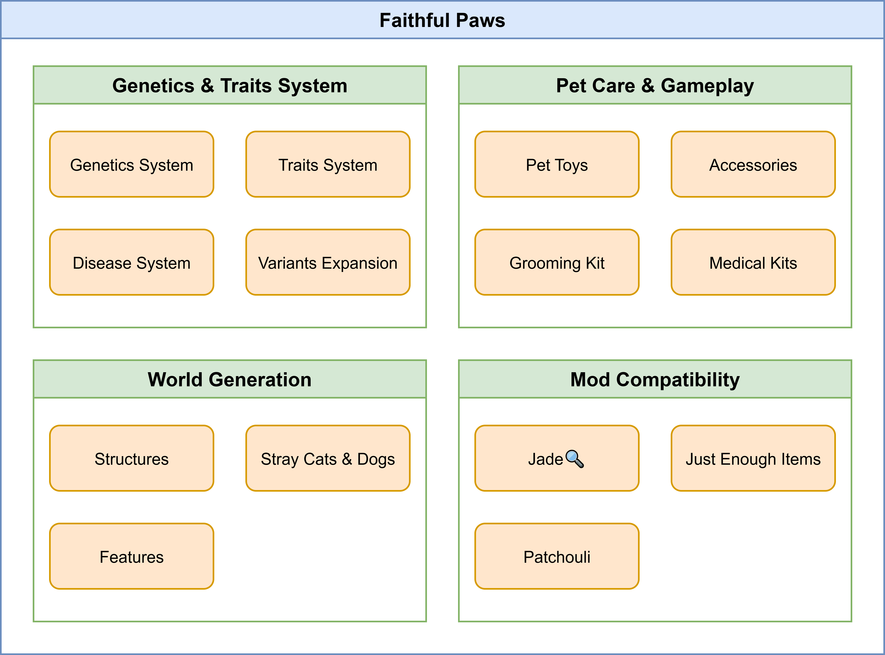

# Product Requirements Document (PRD): Faithful Paws

**Version:** 0.0.1+1.21.1

**Date:** 2025/09/06

**Author:** Liu Dongyu, Author1, Author2, ...

**Status:**

- [x] Draft
- [ ] In Review
- [ ] Approved

**Issue Tracker:** [https://github.com/Viola-Siemens/faithful-paws/issues](https://github.com/Viola-Siemens/faithful-paws/issues)

---

### **1. Overview & Vision**

This document outlines the requirements for the development of the **Faithful Paws** mod for Minecraft. It aims to deeply expand the vanilla pet system, making cats and dogs more unique, engaging, and integrated into the player's journey.

**1.1. Problem Statement**
Currently, Minecraft's cats and dogs, while charming at first glance, lack depth and long-term engagement. Their visual variety is limited, their mechanisms are simple (heal with food, sit/stand), and they offer little progression or customization. Players who want a more meaningful pet ownership experience are left wanting.

**1.2. Vision Statement**
To transform Minecraft's pets from simple companions into unique, lifelong partners with distinct personalities, visual traits, and needs, fostering a deeper emotional connection through care, genetics, and shared adventures.

**1.3. Goals & Success Metrics**

- **Player Adoption:** 5,000 downloads on CurseForge & Modrinth within the first month.
- **Community Sentiment:** Move into the top 20 in terms of "number of interviews", "number of followers", "number of favorites", "number of followers", and "number of short comments" in the MCMOD mod statistics in October/November/December (depends on the date it publishes).
- **Content Creator Adoption:** Feature in at least 2 YouTube, Bilibili, Xiaohongshu videos from top-100 Minecraft creators within the first month.

### **2. User Personas & Stories**

**2.1. Persona 1: The Roleplayer Rachel**

- **Playstyle:** Loves building stories, towns, and lives for her character. Enjoys mods that add life and realism.
- **Goals:** To create a vibrant world with unique characters, including her pets.
- **Frustrations:** Pets all look and act the same, which breaks the immersion of her carefully crafted world. There's no way to make her pet feel truly *hers*.

**2.2. Persona 2: The Collector Cindy**

- **Playstyle:** Driven to collect all variants, max out stats, and achieve 100% completion.
- **Goals:** To find and breed the rarest pet with the perfect combination of traits.
- **Frustrations:** Lack of clear progression or goals related to pets.

**2.3. User Stories**

- **As** Rachel, **I want to** give my cat a unique name and a custom-colored collar **so that I can** distinguish it as my own special companion and add to the story of my character.
- **As** Rachel, **I want to** have my puppy grow up and inherit the fluffy white coat of its mother **so that I can** feel a sense of legacy and continuity in my world's story.
- **As** Cindy, **I want to** breed two dogs with rare traits **so that I can** have a chance to get a puppy with a unique, new coat and special abilities.
- **As** Cindy, **I want to** have a in-game book that tracks all the breeds and traits I've discovered **so that I can** systematically complete my collection.
- **As** a new player, **I want to** find a Pet Store in villages **so that I can** buy pet supplies like collars and toys even if I haven't found a specific biome for a dog/cat variant.

### **3. Competitive Analysis (Mod Landscape)**

<table>
    <tr>
        <th>Mod Name</th>
        <th>Strengths</th>
        <th>Weaknesses</th>
        <th>Open source</th>
        <th>Compatible with 1.20+</th>
        <th>Compatible with 1.16-1.20</th>
        <th>Gallery</th>
        <th>How We Differentiate</th>
    </tr>
    <tr>
        <td><b>Vanilla 1.20.5</b></td>
        <td>Wolf armors and variants</td>
        <td>Focuses on combat. Wolves are still different from pet dogs in our real life.</td>
        <td>-</td>
        <td>-</td>
        <td>-</td>
        <td></td>
        <td>We add dogs and cats variants in our real life to Minecraft, not just modify mechanisms of wolves.</td>
    </tr>
    <tr>
        <td><b>Wolf Armor and Storage</b></td>
        <td>Practical utility (armor, chests).</td>
        <td>Purely utilitarian, no visual/genetic depth.</td>
        <td>✔</td>
        <td>❌</td>
        <td>❌</td>
        <td>-</td>
        <td>We focus on aesthetics, genetics, and role-playing, not just storage.</td>
    </tr>
    <tr>
        <td><b>Not Enough Pets</b></td>
        <td>Backported vanilla features in 1.14.</td>
        <td>Some original cat variants are added. Overall, nothing new to current version of Minecraft.</td>
        <td>✔</td>
        <td>❌</td>
        <td>❌</td>
        <td></td>
        <td>-</td>
    </tr>
    <tr>
        <td><b>Mo&#39; Creatures</b></td>
        <td rowspan="2">Huge variety of animal mobs.</td>
        <td rowspan="2">Can feel bloated, less focused on pet mechanisms.</td>
        <td>❌</td>
        <td>❌</td>
        <td>❌</td>
        <td></td>
        <td rowspan="2">Deep, focused mechanisms on only cats and dogs. Our genetics system is unique.</td>
    </tr>
    <tr>
        <td><b>Paws &amp; Claws</b></td>
        <td>❌</td>
        <td>✔</td>
        <td>✔</td>
        <td></td>
    </tr>
    <tr>
        <td><b>Puppy Paws</b></td>
        <td>Adds 5 vanilla-style dogs.</td>
        <td rowspan="2">Can not breed them.</td>
        <td>❌</td>
        <td>✔</td>
        <td>❌</td>
        <td></td>
        <td rowspan="2">We focus on not only dogs but also cats, and still allow players to breed them.</td>
    </tr>
    <tr>
        <td><b>More Dogs</b></td>
        <td>Adds 6 vanilla-style dogs.</td>
        <td>❌</td>
        <td>❌</td>
        <td>❌</td>
        <td></td>
    </tr>
    <tr>
        <td><b>Doggy Talents</b></td>
        <td>Adds levels and talents for dogs.</td>
        <td rowspan="2">Can feel grindy, aesthetics are still limited.</td>
        <td>✔</td>
        <td>❌</td>
        <td>✔</td>
        <td></td>
        <td rowspan="2">We offer far greater visual variety and a more natural progression via genetics vs. grinding.</td>
    </tr>
    <tr>
        <td><b>Pet Shop</b></td>
        <td>Adds realistic, interactive pets (cats, dogs, and parrots) with complex AI and animations.</td>
        <td>❌</td>
        <td>✔</td>
        <td>✔</td>
        <td></td>
    </tr>
    <tr>
        <td><b>PatPat</b></td>
        <td>Allows players to interact with mobs by patting them.</td>
        <td>Only allows patting for interacting with pets.</td>
        <td>✔</td>
        <td>✔</td>
        <td>✔</td>
        <td></td>
        <td>We offer more mechanisms for players to interact with their pets.</td>
    </tr>
</table>

### **4. Core Features & Modules**

#### 4.1. Genetics & Traits System

- **Description:** The core mechanism that drives variety and progression.
- **Features:**
  - **Genetic Systems:** Puppies/kittens inherit genes from their parents, which express traits. Small chance for a completely new gene to appear when breeding.
  - **Traits System:** Coat color, body size, leg length, health.
  - **Disease System:** Dermatitis (Cross infectious), Distemper (infectious), Enteritis, Indigestion, Parasitosis.
  - **Variants Expansion:** Various models and textures for dogs and cats.

#### 4.2. Pet Care & Gameplay

- **Description:** New interactions to make pet ownership more engaging.
- **Features:**
  - **Pet Toys:** Increase happiness. Pets with high happiness get small buffs (e.g., increased damage, better loot finding).
  
  | Registry Name of Dog Toys   | Ingredients        | Durability | Difficulty | Improvement | Bonus\*                     |
  | --------------------------- | ------------------ | ---------- | ---------- | ----------- | --------------------------- |
  | **faithful_paws:hemp_rope** | string, slime_ball | 15         | ★☆☆☆☆      | ★☆☆☆☆       | (*active* AND *curious*) +2 |
  | **faithful_paws:plush_toy** | wool               | 158        | ★★★☆☆      | ★★★★☆       | *quiet* +2                  |
  | **faithful_paws:frisbee**   | leather            | 245        | ★★★☆☆      | ★★★★☆       | *sporty* +3                 |
  
  | Registry Name of Cat Toys    | Ingredients                              | Durability        | Difficulty | Improvement | Bonus\*      |
  | ---------------------------- | ---------------------------------------- | ----------------- | ---------- | ----------- | ------------ |
  | **faithful_paws:cat_teaser** | stick, slime_ball, feather, copper_ingot | 86                | ★★☆☆☆      | ★★★☆☆       | *curious* +1 |
  | **faithful_paws:cat_box**    | chest, stick                             | (placed as block) | ★★☆☆☆      | ★★★☆☆       | *quiet* +2   |
  | **faithful_paws:toy_fish**   | redstone, leather, wool                  | 69                | ★★★☆☆      | ★★★★☆       | *active* +1  |
  | **faithful_paws:cat_tower**  | planks                                   | (placed as block) | ★★★★☆      | ★★★★★       | *sporty* +1  |
  
  \*Tags are indicated in *Italic* style and namespace `faithful_paws` are omitted.
  
  - **Accessories:** Craftable and cosmetic items that can be equipped.
  
  | Registry Name                         | Ingredient       | Equipment Slot\* | Effect                                                       |
  | ------------------------------------- | ---------------- | ---------------- | ------------------------------------------------------------ |
  | **faithful_paws:elizabethan_collars** | paper, string    | Head             | 10% chance each tick to reduce remaining recovering time after a treatment by 1 tick. |
  | **faithful_paws:tag**                 | name_tag, string | Head             | Ability for other players to see the name of the pet and its owner. |
  | ...                                   |                  | ...              | ... // TODO                                                  |
  
  \*The same as players' four equipment slots (head, chest, legs, feet).
  
  - **Grooming Kits:** Fur gets dirty over time and requires grooming, which makes pets sick. However, cleaning your pet too frequently also makes them unhappy.
  - **Medical Kits:** Treat minor wounds and make pets healthy.

#### 4.3. World Generation

- **Description:** Adding the mod's content naturally into the world.
- **Features:**
  
  - **Structures:** Mod structures can be founded in the villages and outdoors.
  
  | Registry Name                    | Condition                                                    | Functions                                                    | Related villager profession |
  | -------------------------------- | ------------------------------------------------------------ | ------------------------------------------------------------ | --------------------------- |
  | **faithful_paws:pet_shop**       | In village                                                   | 1. Baby pets for sale. 2. Two chests in which players may find accessories, toys and pet foods. | Pet shop owner              |
  | **faithful_paws:animal_clinic**  | In village                                                   | 1. Instruments for examining and healing serious illnesses. 2. Two chests in which players may find medicines. | Veterinarian ($\times2$)    |
  | **faithful_paws:rescue_station** | 1. plains, sunflower_plains 2. desert, beach 3. stony_shore 4. savanna, sparse_jungle | 1. Instruments for examining and healing serious illnesses. 2. A chest in which players may find medicines. | Veterinarian                |
  
  - **Stray Cats and Dogs:** New dog and cat variants spawn in specific biomes (e.g., Huskies in snowy taigas).
  
  | Variant of Dogs   | Biomes       | Pack size   |
  | ----------------- | ------------ | ----------- |
  | Huskies           | snowy_taigas | 2-4         |
  | Alaskan Malamutes | grove        | 2-4         |
  | Samoyeds          | snowy_plains | 2-4         |
  | ...               | ...          | ... // TODO |
  
  - **Features**: // TODO

#### 4.4. Mod Compatibility

- **Description:** Ensuring the mod works well with others.
- **Target Minecraft Version:** 1.21.1 NeoForge
- **Features:**
  - **JEI:** Full support for viewing recipes for items.
  - **Jade:**
  
  | Information     | Pet owner* | Normal player* | Creative player/Operator* |
  | --------------- | ---------- | -------------- | ------------------------- |
  | Pet name        | ✔          | ❌              | ✔                         |
  | Owner           | ✔          | ❌              | ✔                         |
  | Happiness level | ✔          | ❌              | ✔                         |
  | Traits          | ✔          | ❌              | ✔                         |
  | Genes           | ❌          | ❌              | ✔                         |

  \*For each role, "✔" means always visible, "🏷" means visible when tag is equipped, "❌" means always invisible.

  - **Patchouli:** A guide book will be given when players first join in the world.

### **5. Task Priority**

<table>
    <tr>
        <td>Module</td>
        <td>Sub-Module</td>
        <td>Priority</td>
        <td>Status</td>
    </tr>
    <tr>
        <td rowspan="4">Genetics &amp; Traits System</td>
        <td>Genetic Systems</td>
        <td>P0</td>
        <td><input type="checkbox"/></td>
    </tr>
    <tr>
        <td>Traits System</td>
        <td>P0</td>
        <td><input type="checkbox"/></td>
    </tr>
    <tr>
        <td>Disease System</td>
        <td>P2</td>
        <td><input type="checkbox"/></td>
    </tr>
    <tr>
        <td>Variants Expansion</td>
        <td>P0</td>
        <td><input type="checkbox"/></td>
    </tr>
    <tr>
        <td rowspan="4">Pet Care &amp; Gameplay</td>
        <td>Pet Toys</td>
        <td>P2</td>
        <td><input type="checkbox"/></td>
    </tr>
    <tr>
        <td>Accessories</td>
        <td>P1</td>
        <td><input type="checkbox"/></td>
    </tr>
    <tr>
        <td>Grooming Kits</td>
        <td>P2</td>
        <td><input type="checkbox"/></td>
    </tr>
    <tr>
        <td>Medical Kits</td>
        <td>P2</td>
        <td><input type="checkbox"/></td>
    </tr>
    <tr>
        <td rowspan="3">World Generation</td>
        <td>Structures</td>
        <td>P0</td>
        <td><input type="checkbox"/></td>
    </tr>
    <tr>
        <td>Stray Cats and Dogs</td>
        <td>P0</td>
        <td><input type="checkbox"/></td>
    </tr>
    <tr>
        <td>Features</td>
        <td>P3</td>
        <td><input type="checkbox"/></td>
    </tr>
    <tr>
        <td rowspan="3">Mod Compatibility</td>
        <td>JEI</td>
        <td>P1</td>
        <td><input type="checkbox"/></td>
    </tr>
    <tr>
        <td>Jade</td>
        <td>P1</td>
        <td><input type="checkbox"/></td>
    </tr>
    <tr>
        <td>Patchouli</td>
        <td>P0</td>
        <td><input type="checkbox"/></td>
    </tr>
</table>

### **6. Technical Architecture**

- **Target Minecraft Version:** 1.21.1
- **Mod Loaders:** NeoForge.
- **Java Version:** JDK 21
- **Key Dependencies:** Jade (optional), JEI (optional).
